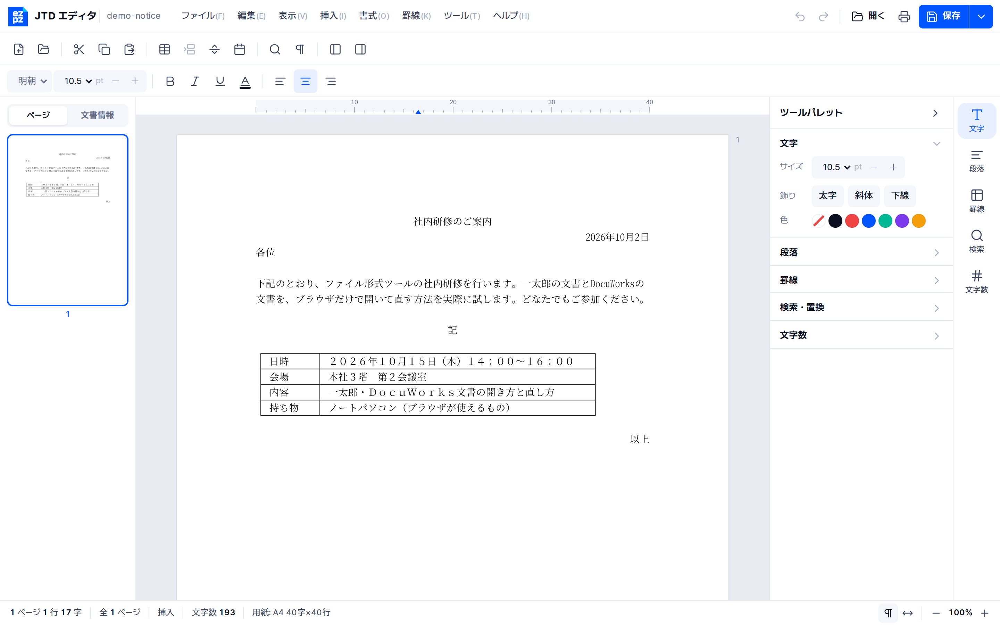

<p align="center">
  
</p>
<h1 align="center">EZPZ File JTD</h1>
<p align="center"><a href="README.md">日本語</a> · <b>English</b> · <a href="README.ko.md">한국어</a></p>

**Open Ichitaro (一太郎) `.jtd` documents anywhere: Mac, Linux, phone, browser.**
An open-source reader and format specification for JustSystems Ichitaro files,
in the spirit of [rhwp](https://github.com/edwardkim/rhwp) for HWP. Files never leave your device.

Status: **v0.3, reader + editor that saves back to `.jtd` (developer preview).** Not affiliated with JustSystems.



<sub>A notice made in the latest Ichitaro, open in the browser editor.</sub>

## What works

Tested on 95 public Ichitaro files (Ichitaro 8 to 2018) published by Japanese ministries:

- all 95 open; about 2 ms per file
- body text: 99.9 % of the visible characters match what **Ichitaro Viewer itself** shows
  (87 of 94 files identical), checked automatically with JustSystems' free viewer
- edited files **save back to `.jtd`**, and Ichitaro Viewer opens them (see below)
- paragraphs, alignment, indents, line feed (改行幅)
- ruled tables (merged cells, column widths, vertical and **horizontal rules**, rules between lines or through them, the 16 **line types**: thick, dotted, double and so on)
- page setup: **paper size and orientation, margins, characters per line and lines per page**, base character size
- font size, bold, underline, colour, ruby (furigana), page breaks
- document properties, including the **original file path** that Ichitaro leaves inside files
- export: plain text, Markdown, HTML, JSON

Not yet: pictures, vertical writing (the setting is read), headers and footers, columns (段組),
`.jttc` (compressed), saving a *new* document as `.jtd`. See the
[roadmap](docs/PLAN.en.md) ([日本語](docs/PLAN.ja.md), [한국어](docs/PLAN.ko.md)).

## Editor

`web/dist/ezpzjtd-editor.html` is a word processor in one file: double-click it, drop a
`.jtd` on the window (or start a new document), edit, and save as **Ichitaro (.jtd)** /
Word / PDF / HTML / text. Like rhwp-studio, the engine lays out and draws the pages itself (canvas); the
browser only supplies keys, the Japanese input method and the screen.

The screen and keys follow Ichitaro so its users feel at home: menu bar with a 罫線
menu, toolbar, jump palette (pages, document info) on the left, tool palette on the
right, ruler in 字 units, status bar with `nページ n行 n字` and 挿入/上書, editing
marks (改行マーク, □ for full-width spaces), and Ichitaro shortcuts (Ctrl+5/6
center/right, Ctrl+↑/↓ size, Ctrl+Y page break, Ctrl+¥ table, F7 font, Ctrl+2 save as,
Esc menu, and a Windows / Ichitaro key-map switch for Ctrl+F). No JustSystems artwork
is used. Details: [docs/EDITOR.en.md](docs/EDITOR.en.md)
([日本語](docs/EDITOR.ja.md), [한국어](docs/EDITOR.ko.md)).

### Saving as `.jtd`

A document opened from a `.jtd` saves back to `.jtd` (Ctrl+S). The engine does not
regenerate the file: it **patches the original**, so everything it does not understand
yet (ruled-line geometry, hidden fields, macros, pictures) stays byte for byte. Text,
paragraphs, bold / size / underline / colour, alignment, indents and line feed, page
breaks and table lines are written (a new row keeps the line types of the row it
copies). Every save is read back and compared with the editor; if anything differs
the save is refused with a reason and nothing is written (then use Word or PDF).

Checked with JustSystems' own Ichitaro Viewer 2022, run automatically through Wine
([tools/taroview](tools/taroview/README.md)): see [experiments/results.md](experiments/results.md) (in Korean).
We also check with **the latest 一太郎 itself** (run through Wine,
[tools/taro2026](tools/taro2026/README.md)): all 274 files saved by the editor open in it,
and a new table draws its vertical and horizontal rules like a table made in Ichitaro. See
[docs/research/ichitaro-latest.md](docs/research/ichitaro-latest.md).

### PDF

Save as PDF writes the pages exactly as drawn on screen, with an invisible text layer
so the PDF can still be searched and copied.

## Try it

**Browser (no install):** build once, then double-click `web/dist/ezpzjtd-editor.html`
(editor) or `web/dist/ezpzjtd-viewer.html` (viewer) and drop a `.jtd` file on it.
Both work offline.

```sh
./web/build.sh
```

**Command line:**

```sh
cd engine
cargo run --release -p ezpzjtd-cli -- text  sample.jtd      # plain text
cargo run --release -p ezpzjtd-cli -- html  sample.jtd > sample.html
cargo run --release -p ezpzjtd-cli -- md    sample.jtd      # Markdown
cargo run --release -p ezpzjtd-cli -- json  sample.jtd      # document model
cargo run --release -p ezpzjtd-cli -- info  sample.jtd      # properties, fonts, sheets
```

Also `ezpzjtd docx <file> <out.docx>`. Research commands: `streams`, `dump <path>`, `tokens`, `styles`,
`experiment <file> <dir>` (variants for checking in Ichitaro Viewer).

**As a library (Rust):**

```rust
let doc = ezpzjtd_core::open(std::fs::read("sample.jtd")?)?;
println!("{}", doc.plain_text());
let html = ezpzjtd_core::export::to_html(&doc);
```

**As a library (JavaScript / WebAssembly):** `web/pkg/` after `./web/build.sh`.

```js
import init, { JtdDocument } from "./pkg/ezpzjtd_wasm.js";
await init();
const doc = new JtdDocument(new Uint8Array(await file.arrayBuffer()));
element.innerHTML = doc.html();
```

## The format

[`docs/spec/JTD-FORMAT.md`](docs/spec/JTD-FORMAT.md) is the working specification.
Every statement is tagged *confirmed / strong / observed / candidate / unknown*.

How we decode it without Ichitaro: Japanese public bodies often publish the same
form as `.jtd` **and** `.doc`. Word's formatting is known, so lining the two files
up character by character tells us what each unknown JTD field means.
`tools/research/` holds those scripts.

Since v0.3 we also use **JustSystems' free Ichitaro Viewer as a referee**: files we
change are opened in the real viewer (Wine, Japanese locale) and their text is
copied back out and compared. That is how we found the per-storage stream directory
(`\x04JSRV_SegmentInformation`) that must match every stream size.

## Repository

```
engine/                Rust workspace
  crates/ezpzjtd-core    reader (CFB → block store → records → styles → model),
                       editor (edit, layout on the 字×行 grid), exporters (docx, pdf, html, md),
                       writer (save.rs: patch the original; cfbw.rs: CFB writer)
  crates/ezpzjtd-cli     `ezpzjtd` command
  crates/ezpzjtd-wasm    WebAssembly bindings
web/                   browser editor (editor.html + editor/app.js) and viewer, built to single files
docs/spec/             format specification
docs/PLAN.*.md         roadmap; docs/EDITOR.*.md editor design (日本語, English, 한국어)
docs/research/         research notes and sample-making guides
tools/                 corpus download and research scripts
tools/taroview/        open files in the real Ichitaro Viewer (Wine) and read back what it shows
tools/taro2026/        make paired samples with the latest 一太郎 (Wine) and open saved files in it
experiments/           notes and results of the viewer checks
corpus/manifest.tsv    URLs of public sample files (files themselves are not committed)
```

## Contributing

The most valuable contribution is **paired samples**: the same document saved twice
from Ichitaro with one setting changed. See
[`docs/research/paired-samples.en.md`](docs/research/paired-samples.en.md).
Please do not commit documents you do not have the right to share.

```sh
python3 tools/fetch_corpus.py --docx   # public corpus → corpus/local/
cd engine && EZPZJTD_CORPUS=$PWD/../corpus/local cargo test
```

## Thanks

Built on the published research of [OpenJTD](https://github.com/KimEJ/OpenJTD) and
[Tika-JTD](https://github.com/KHiyowa/Tika-JTD). See [NOTICE](NOTICE).

## License

MIT License ([LICENSE](LICENSE)). You may use, change, share and sell it freely. Keep the copyright notice
"Copyright (c) 2026 EZPZ File (https://ezpzfile.com)" and the licence text in copies and changed versions.
If you use it in a service or product, a "Powered by EZPZ File" credit somewhere would be appreciated (optional).
"一太郎" / "Ichitaro" are trademarks of JustSystems Corporation.
